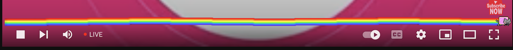

# nyan-plugin-youtube

## To use plugin just pull it open extension page and add plugin folder there

* [Chrome extension page](chrome://extensions/)
* <a href="chrome://extensions/" target="_blank">Link</a>


## Usage
```
# clone project or download as zip
# unzip archive
# open Chrome extension page
# press Load unpacked with path where folder with extensio is
# reload youtube page
```



## License

MIT © 2022 Bogdan Pryvalov
