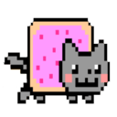
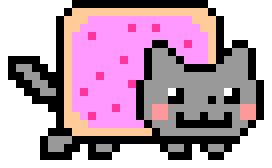
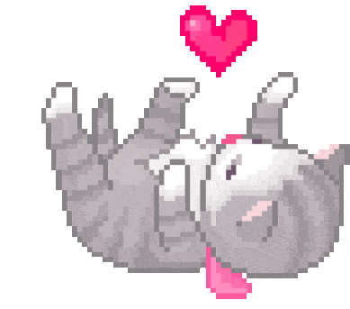
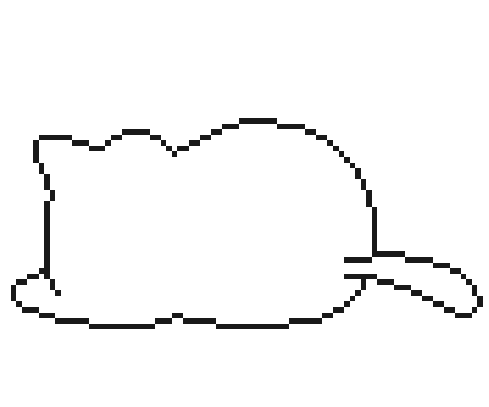
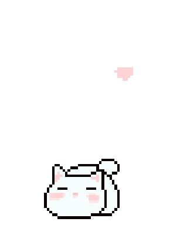

<p align="center">
  
</p>

<h1 align="center">Nyan Progress Bar — Chrome Extension</h1>

<p align="center">
  Replace YouTube's boring progress bar scrubber with an animated cat running across a rainbow trail.<br/>
  Works on youtube.com and music.youtube.com.
</p>

<p align="center">
  <a href="https://chromewebstore.google.com/detail/nyan-cat-extension/oadlabdleegopgjlkcmjjogeaceagbie">
    
  </a>
  <a href="https://chromewebstore.google.com/detail/nyan-cat-extension/oadlabdleegopgjlkcmjjogeaceagbie">
    
  </a>
  <a href="https://chromewebstore.google.com/detail/nyan-cat-extension/oadlabdleegopgjlkcmjjogeaceagbie">
    
  </a>
</p>

---

## About

**Nyan Progress Bar** is a Manifest V3 Chrome extension that replaces the YouTube scrubber with one of 12 animated cat GIFs, adds a rainbow gradient to the played bar, and an animated night-sky to the buffered bar. A popup lets you switch cats, upload your own GIF, fine-tune height and top-offset per cat, change language, and toggle dark/light theme. The companion website at [nyan-progressbar.com](https://nyan-progressbar.com) provides a live customizer that syncs changes directly to open YouTube tabs.

| | |
|---|---|
| **Install** | [Chrome Web Store](https://chromewebstore.google.com/detail/nyan-cat-extension/oadlabdleegopgjlkcmjjogeaceagbie) |
| **Website** | [nyan-progressbar.com](https://nyan-progressbar.com) |
| **70 K+** installs | **4.7 ★** rating · 58 reviews |

### Cat themes

<p>
  
  
  
  
  
  
  
  
  
  
  
  
</p>

---

## Stack

| | |
|---|---|
| Platform | Chrome Extension — Manifest V3 |
| Language | Vanilla JS (ES2020) |
| Bundler | esbuild |
| CSS | csso (minified) |
| Storage | `chrome.storage.local` + `chrome.storage.sync` |
| i18n | 11 locales — en, es, pt, fr, de, uk, pl, vi, id, tl, tr |

---

## Project structure

```
src/
├── js/
│   ├── contentScript.js       # Injected into YouTube — replaces scrubber with cat
│   ├── background.js          # Service worker — handles external messages from website
│   ├── popup.js               # Popup entry point — initialises all modules
│   ├── popup/
│   │   ├── CatGridModule.js         # Cat selection grid
│   │   ├── CustomCatControlsModule.js  # Height/top-offset sliders (per cat)
│   │   ├── GifUploaderModule.js     # Custom GIF upload
│   │   ├── LanguageModule.js        # Language dropdown + translations
│   │   ├── ThemeModule.js           # Dark/light theme toggle
│   │   └── helpers.js               # Shared state, storage helpers
│   ├── consts.js              # catsData, ACTIONS, STORAGE_KEYS, URL patterns
│   ├── i18n.js                # TRANSLATIONS object + language detection
│   └── websiteContentScript.js  # Injected into nyan-progressbar.com — relays popup events
├── styles/
│   ├── popup.css              # Popup UI styles
│   └── content.css            # Styles injected into YouTube
assets/                        # Cat GIFs + rainbow/night-sky images + icons
popup.html                     # Popup markup
manifest.json
```

## Getting started

```bash
# 1. Clone the repo
git clone https://github.com/pryvalovbogdan/nyan-plugin-youtube.git

# 2. Install dependencies
yarn install

# 3. Build the extension
yarn build
```

Then load the `dist/` folder as an unpacked extension in Chrome:

1. Open [chrome://extensions/](chrome://extensions/)
2. Enable **Developer mode**
3. Click **Load unpacked** and select the `dist/` folder
4. Open YouTube — the cat should appear immediately

## Scripts

```bash
yarn build        # Clean, bundle JS, minify CSS, copy assets → dist/
yarn build:js     # Bundle and minify JS only (esbuild)
yarn build:css    # Minify CSS only (csso)
yarn zip          # Build and create extension.zip for distribution
yarn test         # Run unit tests (Vitest)
yarn lint         # Lint JS (ESLint)
yarn style-check  # Lint CSS (Stylelint, src only)
```

The `dist/manifest.json` version is always derived from `package.json` at build time (`scripts/sync-manifest.mjs`), so the two can't drift. Debug logging is enabled in watch builds and stripped from production via esbuild's `--define:__NYAN_DEBUG__`.

CI (`.github/workflows/ci.yml`) runs lint, tests, and a full build on every PR, verifies the version sync, and attaches `extension.zip` to GitHub releases on `v*` tags.

## Adding a new cat

1. Add the GIF to `assets/`
2. Add an entry to `catsData` in `src/js/consts.js` with `src` and `styles.height`, `styles.top`, `styles.topHover`, `styles.topMusic`
3. Run `yarn build`

## License

MIT © Bogdan Pryvalov
